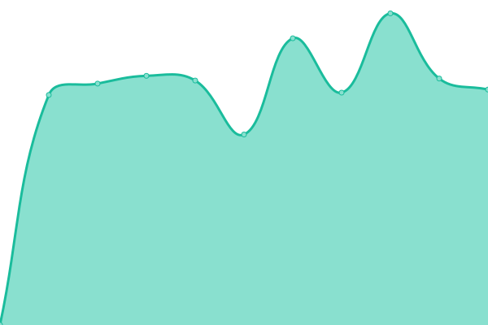
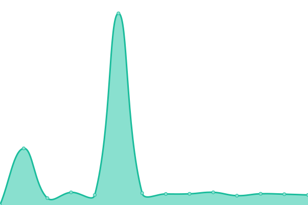

# [📈 Live Status](https://s3rgi.github.io/upptime): <!--live status--> **🟩 All systems operational**

This repository contains the open-source uptime monitor and status page for [s3rgi](https://s3rgi.github.io/upptime), powered by [Upptime](https://github.com/upptime/upptime).

With [Upptime](https://upptime.js.org), you can get your own unlimited and free uptime monitor and status page, powered entirely by a GitHub repository. We use [Issues](https://github.com/s3rgi/upptime/issues) as incident reports, [Actions](https://github.com/s3rgi/upptime/actions) as uptime monitors, and [Pages](https://s3rgi.github.io/upptime) for the status page.

<!--start: status pages-->
<!-- This summary is generated by Upptime (https://github.com/upptime/upptime) -->
<!-- Do not edit this manually, your changes will be overwritten -->
<!-- prettier-ignore -->
| URL | Status | History | Response Time | Uptime |
| --- | ------ | ------- | ------------- | ------ |
|  [WEB](https://www.imasmallorca.net) | 🟩 Up | [web.yml](https://github.com/s3rgi/upptime/commits/HEAD/history/web.yml) | 

 1344ms
     
 | 

<a href="https://stats.imasmallorca.net/history/web">100.00%</a>
    

|  [VPN](https://acces.imasmallorca.net) | 🟩 Up | [vpn.yml](https://github.com/s3rgi/upptime/commits/HEAD/history/vpn.yml) | 

 654ms
     
 | 

<a href="https://stats.imasmallorca.net/history/vpn">100.00%</a>
    

|  [Login corp](https://login.imasmallorca.net) | 🟩 Up | [login-corp.yml](https://github.com/s3rgi/upptime/commits/HEAD/history/login-corp.yml) | 

 597ms
     
 | 

<a href="https://stats.imasmallorca.net/history/login-corp">100.00%</a>
    

|  [Portal del personal](https://portalpersonal.imasmallorca.net) | 🟩 Up | [portal-del-personal.yml](https://github.com/s3rgi/upptime/commits/HEAD/history/portal-del-personal.yml) | 

 530ms
     
 | 

<a href="https://stats.imasmallorca.net/history/portal-del-personal">100.00%</a>
    

|  [Portal formació](https://formacio.imasmallorca.net) | 🟩 Up | [portal-formacio.yml](https://github.com/s3rgi/upptime/commits/HEAD/history/portal-formacio.yml) | 

 923ms
     
 | 

<a href="https://stats.imasmallorca.net/history/portal-formacio">100.00%</a>
    

|  [Correu web](https://correu.imasmallorca.net) | 🟩 Up | [correu-web.yml](https://github.com/s3rgi/upptime/commits/HEAD/history/correu-web.yml) | 

 713ms
     
 | 

<a href="https://stats.imasmallorca.net/history/correu-web">100.00%</a>
    

|  [MTA correu](mail1.imasmallorca.net) | 🟩 Up | [mta-correu.yml](https://github.com/s3rgi/upptime/commits/HEAD/history/mta-correu.yml) | 

 136ms
     
 | 

<a href="https://stats.imasmallorca.net/history/mta-correu">100.00%</a>
    

<!--end: status pages-->

[**Visit our status website →**](https://s3rgi.github.io/upptime)

## 📄 License

- Powered by: [Upptime](https://github.com/upptime/upptime)
- Code: [MIT](./LICENSE) © [s3rgi](https://s3rgi.github.io/upptime)
- Data in the `./history` directory: [Open Database License](https://opendatacommons.org/licenses/odbl/1-0/)
